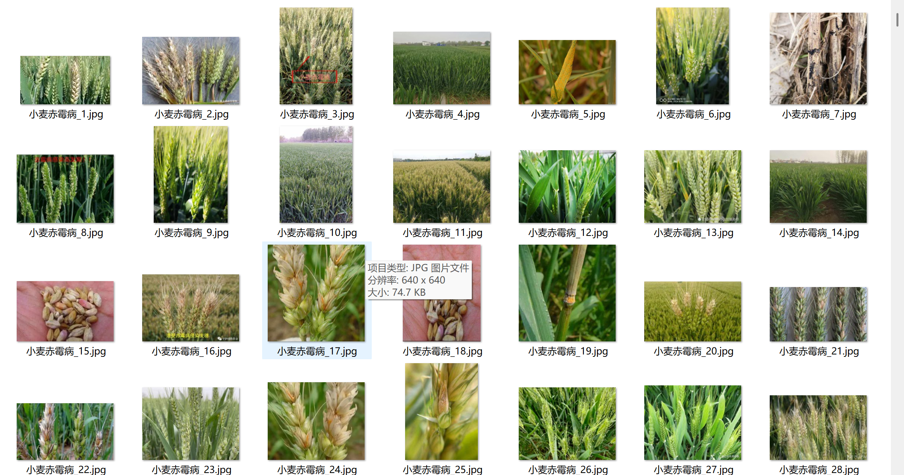
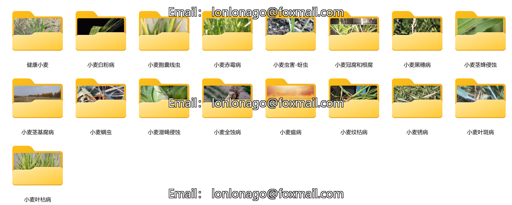
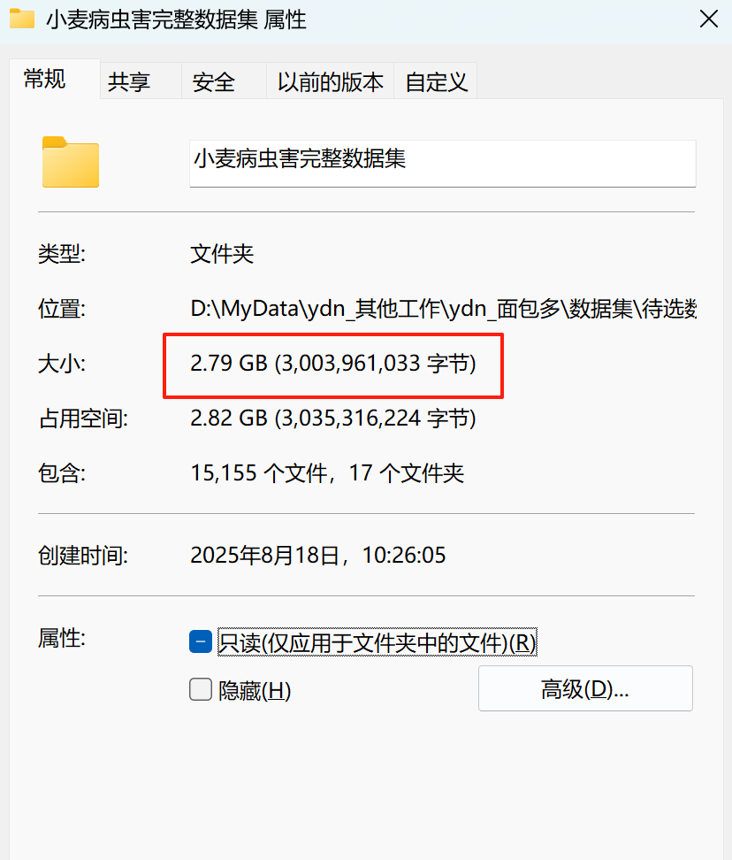

# Wheat Disease and Pests Dataset

Original dataset information:
1. The number of images in the folder "Healthy Wheat": 2304
2. The number of images in the folder "Wheat Root Rot": 137
3. The number of images in the folder "Wheat Leaf Spot": 1144
4. The number of images in the folder "Wheat Blight": 842
5. The number of images in the folder "Wheat Fusarium Wilt": 387
6. The number of images in the folder "Wheat Powdery Mildew": 646
7. The number of images in the folder "Wheat Scab": 1877
8. The number of images in the folder "Wheat Sheath Rot": 496
9. The number of images in the folder "Wheat Sclerotinia Wilt": 52
10. The number of images in the folder "Wheat Stem Rot": 250
11. The number of images in the folder "Wheat Aphid Infestation": 444
12. The number of images in the folder "Wheat Pest - Aphids": 1034
13. The number of images in the folder "Wheat Mite": 631
14. The number of images in the folder "Wheat Smut": 1609
15. The number of images in the folder "Wheat Rust": 1634
16. The number of images in the folder "Wheat Black Sigatoka": 666

Total number of images in all subfolders: 15,155

## Images

Here is a pay link on Stripe ( https://buy.stripe.com/3cs8yP7sY87d0vu9AB ). Please contact me lonlonago@foxmail.com after funding $89, and I will send you a complete data files , thank you!

